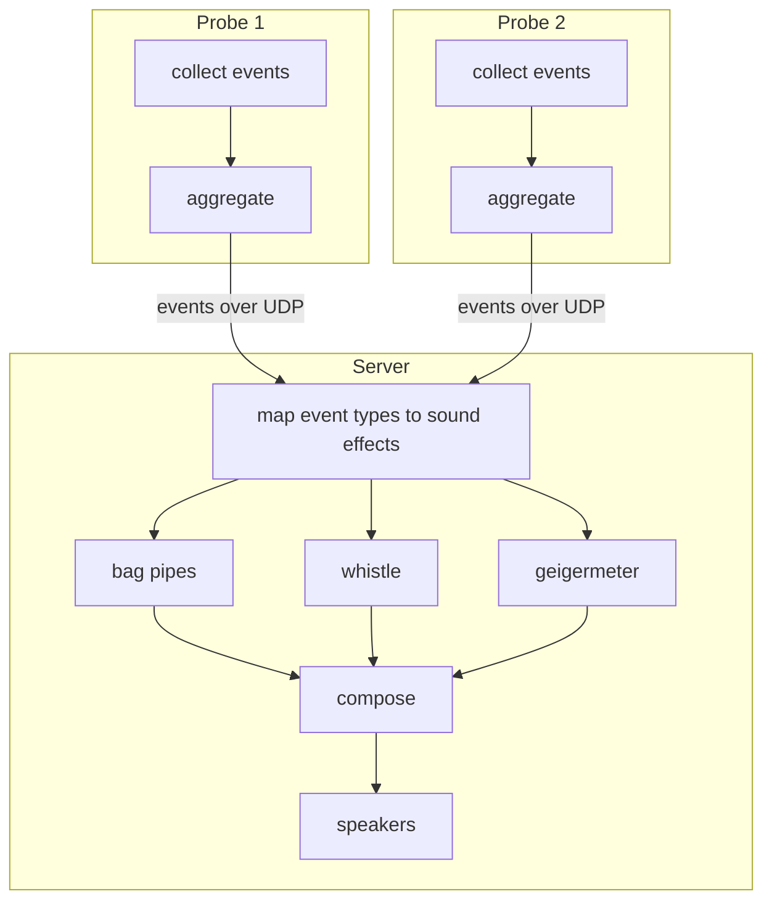

# Acoustic Profiler

Let your software roar!

## Assumptions and Requirements
Let's start with an analogy: the profiled program is like a mechanical gearbox with many cogs that each can make a sound. The sound a cog makes depends on 1) how fast it spins 2) how much power it transmits 3) the shape/material/kind of the cog.

Acoustic profiler makes it fairly easy to
1. implement probes for various types of cogs
2. vary sound effects given to individual cogs
3. hear cogs spinning in remote machine (host)

This necessitates an interface somewhere between the probes and the sound synthesis so that they can be mix-and-matched. This interface also works over network to satisfy 3.

## Interface

On abstract level, the interface is just a stream of Events where event is

```rust
struct Event {
    type: EventType
    // only values between [0, 1]
    quality: f32
}

enum EventType {
    ActorMessageSent,
    FilesystemWriteOrRead
    ...
}
```

The frequency of events encodes how fast a cog spins and the quality encodes the power transmitted through it. (We can add more dimensions later.) We also assume that
- any cog may not turn at all (no incoming events) - then it shouldn't make any sound.
- no cog can turn faster than a human can hear (~20 000 events per second).

Every probe should fit into these limits and every sound-effect should account for the entire range.

## Implementation

Each probe is an individual binary that connects and streams the events to a server over UDP serialized as bincode. The address of the server is passed to the probe with command-line arguments. The probe should aggregate the events to ensure it fits into the above range. Probes are free to send multiple types of events.

The server is a binary that accepts events and assigns a sound effect to every event type it receives. This mapping is set statically in code. Later we can let it be configured with command line options or config file.

We assume that the probe knows best how any given event type should be aggregated. The server is only concerned about assigning sound effects to event types, executing them and composing them all together into the overall sound that is played out.

With this setup we can also scatter probes across multiple machines and "listen to a datacenter".

Can we have a diagram? Sure!


