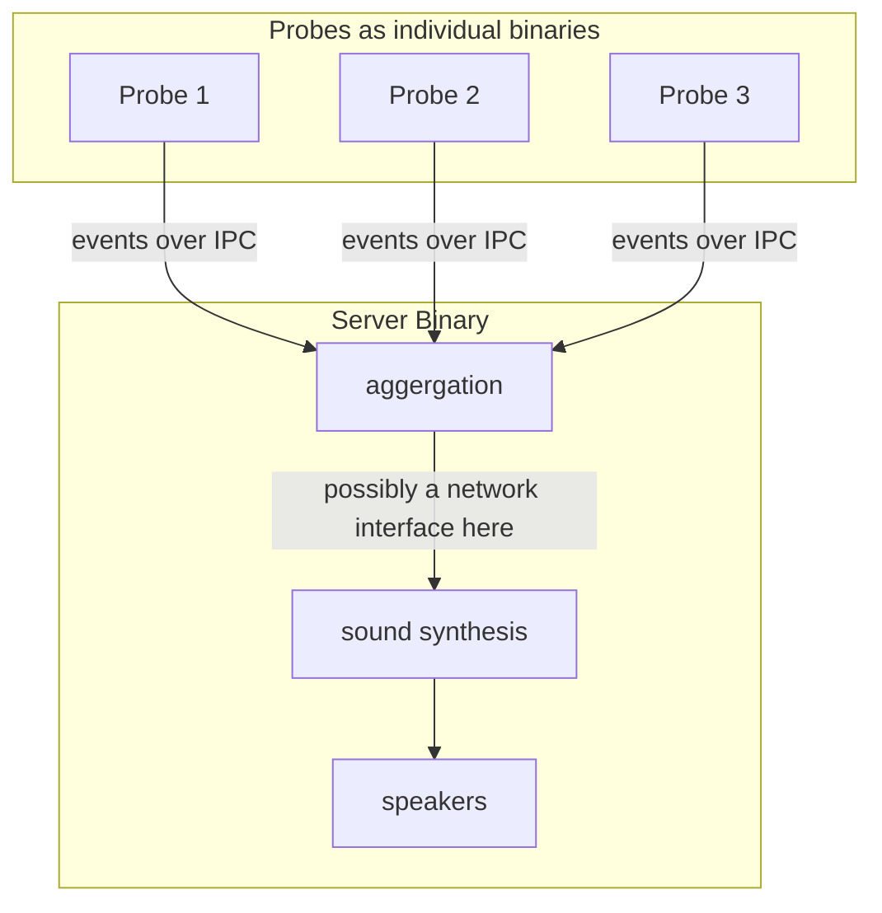

# Acoustic Profiler

Let your software roar!

## Architecture
Tuesday concept:

```mermaid
flowchart TD
    subgraph server [Server Binary]
        S1[aggergation]-->|possibly a network interface here| S2[sound synthesis]
        S2-->S3[speakers]
        end

    subgraph probes [Probes as individual binaries]
        A1[Probe 1] -->|events over IPC| S1
        A2[Probe 2] -->|events over IPC| S1
        A3[Probe 3] -->|events over IPC| S1
        end
```
